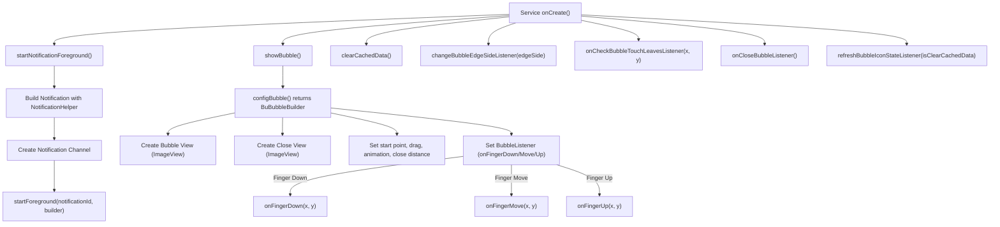

# 🧼 Bububle-Service

Bububle-Service is an Android library that allows you to create and manage floating bubbles (like Facebook Messenger ChatHeads). These bubbles can be dragged, snapped to screen edges, closed, and run as a foreground service — allowing your app to display persistent content over any screen without relying on your main UI or Activity.

## 🚀 Features

✅ System-wide floating bubble  
✅ Fully customizable bubble and close button UI  
✅ Drag & drop support with edge-snapping  
✅ Supports data injection into bubble view  
✅ Runs as a foreground service  
✅ Animated bubble closure

## 📦 Installation

Since the library is not published to MavenCentral or Jitpack yet, you’ll need to clone the repo and import the module manually.

### 1. Import the module into your project:

`settings.gradle`
```
include ':bububle-service'
```

`app/build.gradle`
```
implementation project(':bububle-service')
```

## 🔧 AndroidManifest Configuration

Declare required permissions and services:

```xml
<uses-permission android:name="android.permission.SYSTEM_ALERT_WINDOW"/>
<uses-permission android:name="android.permission.FOREGROUND_SERVICE"/>
<uses-permission android:name="android.permission.FOREGROUND_SERVICE_SPECIAL_USE"/>

<application>
    <service
        android:name="com.example.bubService.service.BaseBubbleService"
        android:exported="false"
        android:stopWithTask="false"
        android:foregroundServiceType="mediaProjection|camera|microphone" />
</application>
```

⚠️ Make sure the user grants the "Draw over other apps" permission manually in system settings.

## 🧪 Usage Example
### 1. Create your own class extending BaseBubbleService:
```Kotlin
class TestBubbleService : BaseBubbleService() {

    override fun onCreate() {
        super.onCreate()
        startNotificationForeground()
        showBubble()
    }

    override fun configBubble(): BuBubbleBuilder {
        val bubbleView = ImageView(this).apply {
            setImageResource(R.drawable.ic_bubble)
            layoutParams = ViewGroup.LayoutParams(80, 80)
        }

        val closeView = ImageView(this).apply {
            setImageResource(R.drawable.ic_close)
            layoutParams = ViewGroup.LayoutParams(80, 80)
        }

        return BuBubbleBuilder(this)
            .bubbleView(bubbleView)
            .closeView(closeView)
            .bubbleStartPoint(Point(100, 300))
            .bubbleForceDragging(true)
            .bubbleAnimateToEdgeEnabled(true)
            .bubbleDistanceToClose(200)
            .bubbleCloseBottomDist(100)
            .bubbleAnimatedClose(true)
    }

    override fun startNotificationForeground() {
        val notificationHelper = NotificationHelper(
            context = this,
            channelId = "bubble_channel",
            channelName = "Bubble Channel"
        )
        val notification = notificationHelper.initNotificationBuilder(
            smallIcon = R.drawable.ic_bubble,
            contentTitle = "Bubble Active",
            contentText = "Bubble is running"
        ).build()

        notificationHelper.createNotificationChannel()
        startForeground(12345, notification)
    }
}
```
### 2. Start the service
```Kotlin
val intent = Intent(context, MyBubbleService::class.java)
ContextCompat.startForegroundService(context, intent)
```

## 📌  Callback Support

You can optionally override the following callback methods in your custom BubbleService:

- onCloseBubbleListener(): Called when the bubble is closed by the user.
- changeBubbleEdgeSideListener(edgeSide: BubbleEdgeSide): Called when the bubble snaps to the left or right edge of the screen.
- onCheckBubbleTouchLeavesListener(x: Float, y: Float): Triggered when the user drags the bubble out of the touchable area.
- refreshBubbleIconStateListener(isClearCachedData: Boolean): Called when the bubble icon should be refreshed, optionally clearing data.
- clearCachedData(): Called to clean up temporary or cached data when the service stops or refreshes.

These callbacks give you full control over bubble interactions and state management.

## 🗺️ Roadmap

Planned and completed features for Bububle-Service:

- Done: Basic draggable and closable floating bubble.
- Done: Foreground service with notification.
- In Progress: Support for multiple bubbles on screen.
- Planned: Jetpack Compose integration for building UI inside the bubble.
- Planned: Smooth expand and collapse animations for bubble UI.
- Planned: Bubble menu actions and long-press options.


## 🧩 Main Components
* BaseBubbleService – Abstract service to extend
* BuBubbleBuilder – Builder class for configuring bubble properties
* BubbleListener – Listener for touch interactions (drag, move, etc.)
* NotificationHelper – Helper class to manage foreground notifications
* BubbleEdgeSide – Enum representing screen edge (LEFT or RIGHT)

## 🗺️ Flow diagram 

